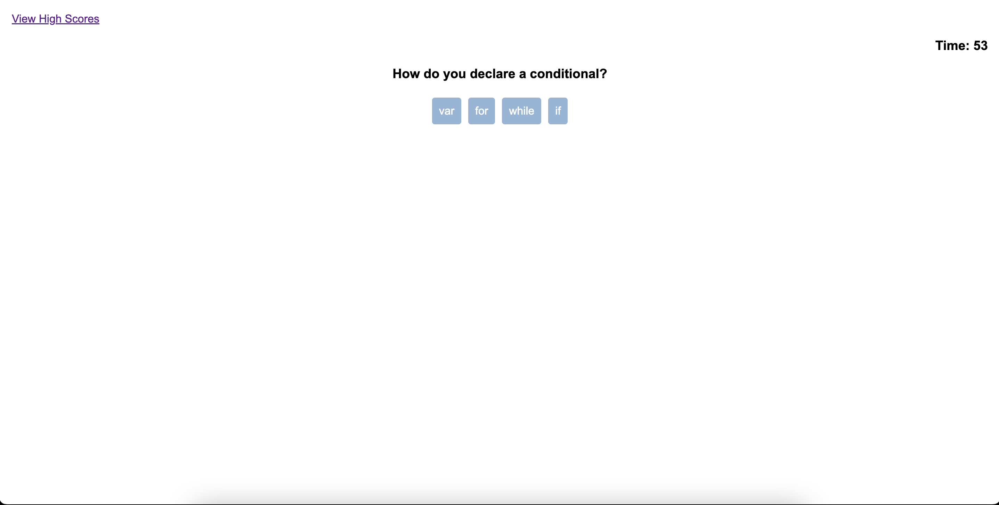

# Code-Quiz

## Description

Made a short multiple choice quiz using mostly javascript. The challenge was good practice using javascript to dynamically place items on a page. Also the use of multiple javscript skills like intervals for the time and multiple on click events. Finally the challenge used local storage for the storage of high scores.

## Installation

App deployed to Github pages
https://nuglah.github.io/ryan-green-code-quiz/

## Usage

Multiple choice quiz. Timer will start when you click start game. Choose an answer by clicking one of the buttons. If the correct button is clicked a point will be added. If the wrong answer is chosen it will subtract some time. When the time runs out or all questions are answered, the score will be shown with a text box to write initials. This will show you a high score list. Also high scores can be accesed fom top left link.

